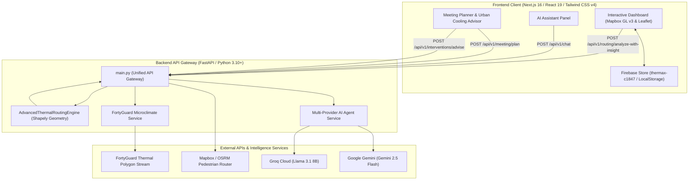

# 🌡️ ThermaX — Unified Microclimate Routing & Urban Heat Risk AI Intelligence

[](https://fastapi.tiangolo.com)
[](https://nextjs.org)
[](https://react.dev)
[](https://www.python.org)
[](https://www.mapbox.com)
[](https://firebase.google.com)
[](https://vercel.com)
[](LICENSE)


**ThermaX** is an enterprise-grade microclimate routing and urban heat risk intelligence platform designed to protect pedestrians, outdoor workers, and urban planners from extreme urban heat stress. By synthesizing live high-resolution thermal overlay data (via **FortyGuard Microclimate API**), spatial polyline intersection algorithms (via **Shapely**), routing engines (**Mapbox GL** & **OSRM**), real-time database persistence (**Firebase**), and multi-provider LLM AI gateways (**Groq Cloud** & **Google Gemini**), ThermaX computes walking paths optimized for thermal safety and delivers actionable urban heat advice.

---

## 📑 Table of Contents

- [🌟 Key Features](#-key-features)
- [🏗 System Architecture](#-system-architecture)
- [🧮 Heat Risk Mathematical Engine](#-heat-risk-mathematical-engine)
- [🛠 Tech Stack Matrix](#-tech-stack-matrix)
- [📁 Project Structure](#-project-structure)
- [🚀 Quickstart & Setup](#-quickstart--setup)
  - [Option A: 1-Click PowerShell Launcher (Windows)](#option-a-1-click-powershell-launcher-windows)
  - [Option B: Manual Installation](#option-b-manual-installation)
- [🔑 Environment Configuration](#-environment-configuration)
- [📡 API Endpoint Reference](#-api-endpoint-reference)
  - [1. Health Check (`GET /health`)](#1-health-check-get-health)
  - [2. Route Heat Analysis (`POST /api/v1/routing/analyze`)](#2-route-heat-analysis-post-apiv1routinganalyze)
  - [3. Route Heat Analysis with AI Insights (`POST /api/v1/routing/analyze-with-insight`)](#3-route-heat-analysis-with-ai-insights-post-apiv1routinganalyze-with-insight)
  - [4. Multi-Model AI Chat Gateway (`POST /api/v1/chat`)](#4-multi-model-ai-chat-gateway-post-apiv1chat)
  - [5. AI Outdoor Meeting Planner (`POST /api/v1/meeting/plan`)](#5-ai-outdoor-meeting-planner-post-apiv1meetingplan)
  - [6. Urban Cooling Advisory Engine (`POST /api/v1/interventions/advise`)](#6-urban-cooling-advisory-engine-post-apiv1interventionsadvise)
- [🖥 Frontend Dashboard Overview](#-frontend-dashboard-overview)
- [☁️ Production Deployment](#️-production-deployment)
- [📜 License](#-license)

---

## 🌟 Key Features

* **🌡️ Microclimate-Aware Spatial Pathfinding**: Intersects pedestrian routing polylines against live thermal polygons ($T_s$) and shade coverage ($S$) to construct heat-minimized walking routes.
* **🛰️ FortyGuard Integration & High-Density Fallback**: Streams high-precision surface temperature polygons from FortyGuard with synthetic fallback grid generators across hot climate hubs (*Phoenix, Dubai, Abu Dhabi, Riyadh, Las Vegas, Seville*).
* **🔥 NOAA Rothfusz Heat Index Math**: Calculates ambient Heat Index ($HI$) combining dry-bulb surface temperature and relative humidity ($RH$) to compute true perceived thermal stress.
* **🤖 Dual Provider LLM Gateway**: Lazy-loads **Groq** (`llama-3.1-8b-instant`) and **Google Gemini** (`gemini-2.5-flash`) with dynamic provider selection, fallback logic, and grounded data prompting.
* **📅 Grounded AI Outdoor Meeting Planner**: Evaluates proposed event timing against microclimate heat metrics to deliver safety advice, optimal meeting windows, and hydration strategies.
* **🏙️ Urban Cooling Intervention Advisory**: Recommends targeted urban infrastructure modifications (*cool roofs, tree canopies, shade sails, permeable paving*) based on measured thermal readings.
* **🗺️ Dual Interactive Map Visualizers**: Interactive vector map using **Mapbox GL v3** with smooth camera transitions and segment tooltips, complemented by an offline **Leaflet GL** renderer fallback.
* **💾 Real-Time History & Firebase Sync**: Persists routing queries, meeting reports, and cooling recommendations across browser sessions using Firebase Firestore (`thermax-c1847`) and local storage.
* **⚡ 1-Click PowerShell Launcher**: Automated script (`start-thermax.ps1`) for single-command virtual environment provisioning, Node package resolution, and server launch.

---

## 🏗 System Architecture



---

## 🧮 Heat Risk Mathematical Engine

The core spatial engine evaluates pedestrian route polylines intersecting thermal overlay polygons using a multi-factor scoring algorithm:

### 1. Relative Humidity & Perceived Heat Index ($HI$)
Calculated using the NOAA Rothfusz regression equation:

$$HI_{F} = -42.379 + 2.04901523 T + 10.14333127 RH - 0.22475541 T \cdot RH - 0.00683783 T^2 - 0.05481717 RH^2 + \dots$$

### 2. Multi-Factor Segment Risk Score
For each polyline segment intersecting microclimate tile $i$:

$$\text{Composite Risk}_i = \left( w_{\text{temp}} \cdot \hat{T}_i + w_{\text{hi}} \cdot \hat{HI}_i + w_{\text{shade}} \cdot (1 - \hat{S}_i) \right) \times 100$$

Where:
* $w_{\text{temp}} = 0.5$, $w_{\text{hi}} = 0.3$, $w_{\text{shade}} = 0.2$
* $\hat{T}_i, \hat{HI}_i$ are min-max normalized surface temperature and heat index metrics.
* $\hat{S}_i \in [0, 1]$ represents shade coverage fraction.

### 3. Route Selection Policy Presets
* **`shortest_path`**: Allows up to **5%** extra distance for cooler routes.
* **`balanced`** *(Default)*: Allows up to **20%** extra distance for proportional heat reduction.
* **`coolest_path`**: Prioritizes minimum total thermal risk score without distance constraint ($\infty$).

---

## 🛠 Tech Stack Matrix

| Layer | Component | Technologies |
| :--- | :--- | :--- |
| **Backend Framework** | API Gateway & Routing | Python 3.10+, FastAPI, Uvicorn, Pydantic v2 |
| **Spatial Engine** | Polyline Geometry & Intersection | Shapely 2.0+, OSRM, Mapbox Directions |
| **AI Gateway** | Multi-Model Reasoning | Groq SDK (`groq`), Google GenAI SDK (`google-genai`) |
| **Microclimate Engine** | Microclimate Data Stream | FortyGuard API, Custom GeoJSON Grid Generator |
| **Frontend Framework** | UI Dashboard & State | Next.js 16 (App Router), React 19, TypeScript |
| **Visualization & Styling**| Maps & Aesthetics | Mapbox GL JS v3, Leaflet, Tailwind CSS v4, Lucide Icons |
| **Persistence** | Session & Report Storage | Firebase Firestore (`thermax-c1847`), LocalStorage |
| **Tooling & Setup** | Deployment & Automation | PowerShell 7+, `pnpm`, Vercel Serverless, Render |

---

## 📁 Project Structure

```text
ThermaX/
├── thermax_backend/                # FastAPI Microclimate Gateway
│   ├── main.py                     # Unified API Gateway & Endpoint Handlers
│   ├── thermal_overlay_engine.py   # Multi-factor Heat Risk Engine & Shapely Math
│   ├── services/
│   │   ├── ai_agent_service.py     # Groq & Gemini Multi-Model LLM Gateway
│   │   ├── fortyguard_service.py   # FortyGuard Microclimate API & Grid Fallback
│   │   └── routing_service.py      # Mapbox & OSRM Pedestrian Polyline Router
│   ├── .env                        # Local Environment Keys (git-ignored)
│   └── .gitignore                  # Backend Git Ignore Rules
│
├── frontend/                       # Next.js 16 App Router Web Client
│   ├── app/                        # Next.js App Router
│   │   ├── page.tsx                # Main Dashboard Page
│   │   ├── layout.tsx              # Root Layout & Font Definitions
│   │   └── globals.css             # Glassmorphism & Thermal CSS Styling
│   ├── components/                 # UI & Visualization Components
│   │   ├── mapbox-route-map.tsx    # Mapbox GL Vector Map Engine
│   │   └── leaflet-route-map.tsx   # Offline/Fallback Leaflet Map Component
│   ├── lib/                        # Client Utilities & State Management
│   │   ├── api.ts                  # Backend API Client & Fallback Models
│   │   └── history.ts              # Firebase & Local Storage Sync Layer
│   ├── public/                     # Static Web Assets (Logos, Icons)
│   ├── package.json                # Frontend Dependencies
│   ├── next.config.ts              # Next.js Proxy Rewrites Configuration
│   └── tsconfig.json               # TypeScript Configuration
│
├── .env.example                    # Global Environment Template
├── requirements.txt                # Python Dependencies Specification
├── render.yaml                     # Render Cloud Backend Specification
├── start-thermax.ps1               # 1-Click PowerShell Environment Bootstrapper
└── README.md                       # Master Repository Documentation
```

---

## 🚀 Quickstart & Setup

### Option A: 1-Click PowerShell Launcher (Windows)

Launch PowerShell in the root repository folder and run:

```powershell
.\start-thermax.ps1
```

*The automated script provisions `.venv`, installs `requirements.txt`, resolves Node packages with `pnpm`, fires the FastAPI server on port **`8001`**, and opens the Next.js client at **`http://localhost:3000`**.*

---

### Option B: Manual Installation

#### 1. Backend Setup

```bash
# Navigate to repository root
cd ThermaX

# Create and activate Python virtual environment
python -m venv .venv

# On Linux/macOS:
source .venv/bin/activate
# On Windows (PowerShell):
# .\.venv\Scripts\Activate.ps1

# Install backend dependencies
pip install --upgrade pip
pip install -r requirements.txt

# Launch FastAPI backend
cd thermax_backend
uvicorn main:app --reload --port 8001
```

*Swagger API interactive documentation is served live at **`http://localhost:8001/docs`**.*

#### 2. Frontend Setup

```bash
# Open a second terminal session in the frontend folder
cd frontend

# Install Node dependencies
pnpm install

# Start Next.js client
pnpm dev
```

*Access the web dashboard in your browser at **`http://localhost:3000`**.*

---

## 🔑 Environment Configuration

Create a `.env` file in the root folder (or `.env.local` inside `frontend`):

```env
# AI Gateway Keys
GROQ_API_KEY="your_groq_api_key_here"
GEMINI_API_KEY="your_gemini_api_key_here"

# FortyGuard Thermal API
FORTYGUARD_API_KEY="your_fortyguard_api_key_here"
FORTYGUARD_BASE_URL="https://api.fortyguard.com/v1"

# Frontend Public Mapbox Token
NEXT_PUBLIC_MAPBOX_TOKEN="pk.your_mapbox_public_token_here"
NEXT_PUBLIC_API_BASE_URL="http://127.0.0.1:8001"
```

---

## 📡 API Endpoint Reference

### 1. Health Check (`GET /health`)
Verifies service availability and external API key readiness.

```json
{
  "status": "ok",
  "groq_configured": true,
  "gemini_configured": true,
  "fortyguard_configured": true
}
```

---

### 2. Route Heat Analysis (`POST /api/v1/routing/analyze`)
Evaluates candidate route polylines against FortyGuard thermal overlay polygons.

**Request Payload:**
```json
{
  "origin": [-112.074, 33.448],
  "destination": [-112.064, 33.458],
  "city": "Phoenix",
  "user_preference": "balanced",
  "humidity": 45.0
}
```

**Response Payload:**
```json
{
  "decision": {
    "selected_route": "alternative",
    "user_preference": "balanced",
    "max_extra_dist_pct_applied": 20.0,
    "risk_score_savings": 14.25,
    "extra_distance_pct": 8.50,
    "original_route": {
      "total_distance_deg": 0.014142,
      "multi_factor_risk_score": 62.10,
      "segments_count": 8
    },
    "alternative_route": {
      "total_distance_deg": 0.015344,
      "multi_factor_risk_score": 47.85,
      "segments_count": 9
    }
  },
  "routes_geojson": { "type": "FeatureCollection", "features": [...] },
  "thermal_overlay_geojson": { "type": "FeatureCollection", "features": [...] }
}
```

---

### 3. Route Heat Analysis with AI Insights (`POST /api/v1/routing/analyze-with-insight`)
Combines geometric route analysis with AI-synthesized safety explanations.

**Response Structure:**
```json
{
  "decision": { ... },
  "routes_geojson": { ... },
  "thermal_overlay_geojson": { ... },
  "ai_insight": {
    "provider": "groq",
    "model": "llama-3.1-8b-instant",
    "response": "The alternative route reduces your heat risk score by 14.25 points with only an 8.5% increase in walking distance. It leverages shaded canopy corridors along 3rd Street. Recommendation: Carry water and stay hydrated."
  }
}
```

---

### 4. Multi-Model AI Chat Gateway (`POST /api/v1/chat`)
Direct entry-point for microclimate Q&A using Groq or Gemini models.

**Request Payload:**
```json
{
  "prompt": "What are the recommended hydration guidelines for walking in desert microclimates above 40°C?",
  "provider": "groq",
  "model": "llama-3.1-8b-instant",
  "system_instruction": "You are an AI assistant for ThermaX thermal routing and heat risk management."
}
```

---

### 5. AI Outdoor Meeting Planner (`POST /api/v1/meeting/plan`)
Grounded thermal event planning backed by microclimate data.

**Request Payload:**
```json
{
  "location": "ASU Tempe Campus Outdoor Quad",
  "meeting_time": "2026-08-31T14:00",
  "city": "Phoenix"
}
```

---

### 6. Urban Cooling Advisory Engine (`POST /api/v1/interventions/advise`)
Provides data-backed cooling infrastructure suggestions for urban sites.

**Request Payload:**
```json
{
  "place_type": "School",
  "location": "Downtown Phoenix Elementary",
  "city": "Phoenix"
}
```

---

## 🖥 Frontend Dashboard Overview

The Next.js 16 web interface delivers an immersive thermal experience:

* **Interactive Map Studio**: Toggle between Mapbox GL vector map and Leaflet map, inspect color-coded surface temp polygons ($T_s$), and view segment-level risk tooltips.
* **Microclimate Control Hub**: Select target cities (*Phoenix, Dubai, Abu Dhabi, Riyadh, Las Vegas, Seville*), input coordinates, adjust relative humidity sliders, and choose route optimization presets.
* **Real-Time Route Insights**: Detailed cards showing distance comparison, segment count, heat score savings, and AI explanations.
* **Meeting & Cooling Widgets**: Dedicated tools for scheduling heat-safe outdoor activities and analyzing urban cooling interventions.

---

## ☁️ Production Deployment

### Vercel Deployment 

ThermaX supports serverless execution on Vercel:

1. **Backend Service**:
   - Create a project in Vercel for the repository.
   - Set Environment Variables: `GROQ_API_KEY`, `GEMINI_API_KEY`, `FORTYGUARD_API_KEY`.
   - Deploy as Python serverless using `thermax_backend/vercel.json`.

2. **Frontend Client**:
   - Create a second Vercel project with Root Directory set to `frontend`.
   - Set Environment Variable: `NEXT_PUBLIC_MAPBOX_TOKEN` and `BACKEND_URL`.
   - Deploy. Rewrites in `next.config.ts` automatically route backend traffic.

---

## 📜 License

Distributed under the **MIT License**. See `LICENSE` for details.

---

<p align="center">
  Made with ❤️ by the ThermaX Team · Engineered for Urban Resilience & Pedestrian Thermal Safety
</p>

