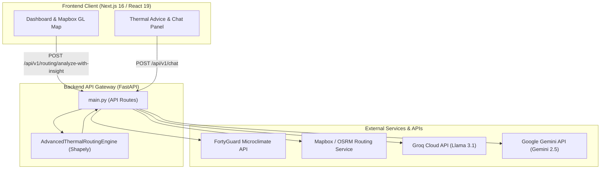

# 🌡️ ThermaX  Unified Thermal Routing & Urban Heat Risk AI Gateway

[](https://fastapi.tiangolo.com)
[](https://nextjs.org)
[](https://www.python.org)
[](https://www.mapbox.com)
[](LICENSE)
[](https://vercel.com)
[](https://react.dev)


**ThermaX** is an enterprise-grade, microclimate-aware navigation and AI advisory platform designed to protect pedestrians from extreme urban heat. By synthesizing live high-resolution thermal overlay data (via FortyGuard), spatial polyline intersection math (via Shapely), Mapbox/OSRM routing engines, and multi-model LLM AI gateways (Groq & Google Gemini), ThermaX computes walking paths optimized for thermal comfort and provides real-time health risk guidance.

---

## 📑 Table of Contents

- [🌟 Key Features](#-key-features)
- [🏗 System Architecture](#-system-architecture)
- [🧮 Heat Risk Mathematical Engine](#-heat-risk-mathematical-engine)
- [🛠 Tech Stack](#-tech-stack)
- [📁 Project Structure](#-project-structure)
- [🚀 Quickstart & Setup](#-quickstart--setup)
  - [Option A: 1-Click PowerShell Launcher (Windows)](#option-a-1-click-powershell-launcher-windows)
  - [Option B: Manual Installation](#option-b-manual-installation)
- [🔑 Environment Configuration](#-environment-configuration)
- [📡 API Endpoint Reference](#-api-endpoint-reference)
- [🖥 Frontend Dashboard Overview](#-frontend-dashboard-overview)
- [☁️ Production Deployment](#️-production-deployment)
- [📜 License](#-license)

---

## 🌟 Key Features

* **🌡️ Thermal-Aware Spatial Pathfinding**: Intersects pedestrian routing polylines against real-time microclimate polygons to minimize pedestrian heat stress.
* **🛰️ FortyGuard Microclimate API Integration**: Dynamically streams high-resolution surface temperature ($T_s$) and shade coverage ($S$) data, backed by localized fallback polygon mocks for uninterrupted reliability.
* **🔥 Dynamic Heat Index Computation**: Calculates ambient Heat Index ($HI$) using the Rothfusz equation to account for relative humidity and true heat perception.
* **🤖 Multi-Provider LLM Gateway**: Seamlessly routes AI queries between **Groq** (e.g., `llama-3.1-8b-instant`) and **Google Gemini** (e.g., `gemini-2.5-flash`) with lazy-loaded SDK initialization and graceful fallback handling.
* **💡 Route Insight Engine (`/analyze-with-insight`)**: Synthesizes spatial microclimate metrics with LLM reasoning to explain routing decisions and deliver contextual safety recommendations.
* **🗺️ Modern Next.js 16 Dashboard**: Interactive Mapbox GL vector map rendering heat risk zones, route comparisons, real-time metrics cards, and an integrated climate advice chatbot.
* **⚡ One-Click Local Launcher**: Automated PowerShell script (`start-thermax.ps1`) for instant provisioning of Python virtual environments and Node `pnpm` dependencies.

---

## 🏗 System Architecture



---

## 🧮 Heat Risk Mathematical Engine

The core routing engine evaluates each route segment intersecting a thermal microclimate polygon using a multi-factor scoring function:

### 1. Relative Humidity & Heat Index ($HI$)
Using the NOAA/Rothfusz regression equation:

$$HI_{F} = -42.379 + 2.04901523 T + 10.14333127 RH - 0.22475541 T \cdot RH - 0.00683783 T^2 - 0.05481717 RH^2 + \dots$$

### 2. Normalized Segment Risk Score
For a given polygon segment:

$$\text{Composite Risk} = \left( w_{\text{temp}} \cdot \hat{T} + w_{\text{hi}} \cdot \hat{HI} + w_{\text{shade}} \cdot (1 - \hat{S}) \right) \times 100$$

Where:
* $w_{\text{temp}} = 0.5$, $w_{\text{hi}} = 0.3$, $w_{\text{shade}} = 0.2$
* $\hat{T}, \hat{HI}$ are min-max normalized metrics against configured operating ranges.
* $\hat{S}$ is shade coverage percentage converted to an exposure factor.

### 3. Route Selection Policy Presets
* **`shortest_path`**: Allows up to 5% extra distance for cooler routes.
* **`balanced`** *(Default)*: Allows up to 20% extra distance for heat risk savings.
* **`coolest_path`**: Prioritizes minimum risk score regardless of distance threshold ($\infty$).

---

## 🛠 Tech Stack

| Component | Technologies Used |
| :--- | :--- |
| **Backend Framework** | Python 3.10+, FastAPI, Uvicorn, Pydantic v2 |
| **Spatial Engine** | Shapely (Geometry Intersection), Requests |
| **AI / LLM Gateway** | Groq SDK (`groq`), Google GenAI SDK (`google-genai`) |
| **Frontend Framework** | Next.js 16 (App Router), React 19, TypeScript |
| **Map & Styling** | Mapbox GL JS v3, Tailwind CSS v4, Lucide React Icons |
| **Environment & Package Mgmt** | `pnpm`, Python `venv`, PowerShell, Docker / Render |

---

## 📁 Project Structure

```text
ThermaX/
├── thermax_backend/                # FastAPI Backend Application
│   ├── main.py                     # Unified API Gateway & Endpoint handlers
│   ├── thermal_overlay_engine.py   # Multi-factor heat risk math & Shapely engine
│   ├── services/
│   │   ├── ai_agent_service.py     # Multi-provider LLM handler (Groq & Gemini)
│   │   ├── fortyguard_service.py   # FortyGuard Microclimate API integration & fallback
│   │   └── routing_service.py      # Mapbox / OSRM pedestrian routing service
│   └── .gitignore                  # Backend git ignore rules
│
├── frontend/                       # Next.js 16 Web Dashboard
│   ├── app/                        # Next.js App Router (page.tsx, layout.tsx, globals.css)
│   ├── components/                 # React UI components (mapbox-route-map.tsx)
│   ├── public/                     # Static web assets
│   ├── package.json                # Frontend dependencies & scripts
│   ├── next.config.ts              # Next.js configuration & API proxy setup
│   └── tsconfig.json               # TypeScript configuration
│
├── .env.example                    # Template for environment variables
├── requirements.txt                # Python backend dependencies
├── render.yaml                     # Render Cloud deployment specification
├── start-thermax.ps1               # 1-Click PowerShell bootstrap & launch script
└── README.md                       # Comprehensive Project Documentation
```

---

## 🚀 Quickstart & Setup

### Option A: 1-Click PowerShell Launcher (Windows)

Simply open PowerShell in the project root directory and execute:

```powershell
.\start-thermax.ps1
```

*This launcher automatically initializes the Python virtual environment (`.venv`), installs `requirements.txt`, resolves Node dependencies using `pnpm`, starts the FastAPI backend on port `8001`, and launches the Next.js development server at **`http://localhost:3000`**.*

---

### Option B: Manual Installation

#### 1. Backend Setup

```bash
# Navigate to project root
cd ThermaX

# Create and activate virtual environment
python -m venv .venv

# On Linux/macOS:
source .venv/bin/activate
# On Windows (PowerShell):
# .\.venv\Scripts\Activate.ps1

# Install backend dependencies
pip install --upgrade pip
pip install -r requirements.txt

# Start FastAPI server
cd thermax_backend
uvicorn main:app --reload --port 8001
```

*Backend interactive API documentation (Swagger UI) is accessible at **`http://localhost:8001/docs`**.*

#### 2. Frontend Setup

```bash
# Open a new terminal in the frontend directory
cd frontend

# Install Node dependencies
pnpm install

# Start Next.js development server
pnpm dev
```

*Open your browser and navigate to **`http://localhost:3000`**.*

---

## 🔑 Environment Configuration

Create a `.env` file in the root directory (refer to `.env.example`):

```env
# AI Service Credentials
GROQ_API_KEY="your_groq_api_key_here"
GEMINI_API_KEY="your_gemini_api_key_here"

# Microclimate API Credentials
FORTYGUARD_API_KEY="your_fortyguard_api_key_here"
FORTYGUARD_BASE_URL="https://api.fortyguard.com/v1"

# Mapbox Access Token (Frontend)
NEXT_PUBLIC_MAPBOX_TOKEN="your_mapbox_public_access_token_here"
```

---

## 📡 API Endpoint Reference

### 1. Health & Status Check
* **Method**: `GET`
* **Path**: `/health`
* **Description**: Verifies service status and external API key readiness.

```json
{
  "status": "ok",
  "groq_configured": true,
  "gemini_configured": true,
  "fortyguard_configured": true
}
```

---

### 2. Route Heat Analysis
* **Method**: `POST`
* **Path**: `/api/v1/routing/analyze`
* **Description**: Evaluates pedestrian route polylines against thermal overlay polygons.

**Request Payload:**
```json
{
  "origin": [-112.074, 33.448],
  "destination": [-112.064, 33.458],
  "city": "Phoenix",
  "user_preference": "balanced",
  "humidity": 45.0
}
```

**Response Payload:**
```json
{
  "decision": {
    "selected_route": "alternative",
    "user_preference": "balanced",
    "max_extra_dist_pct_applied": 20.0,
    "risk_score_savings": 14.25,
    "extra_distance_pct": 8.50,
    "original_route": {
      "total_distance_deg": 0.014142,
      "multi_factor_risk_score": 62.10,
      "segments_count": 1
    },
    "alternative_route": {
      "total_distance_deg": 0.015344,
      "multi_factor_risk_score": 47.85,
      "segments_count": 1
    }
  },
  "routes_geojson": { "type": "FeatureCollection", "features": [] },
  "thermal_overlay_geojson": { "type": "FeatureCollection", "features": [] }
}
```

---

### 3. Route Heat Analysis with AI Insights
* **Method**: `POST`
* **Path**: `/api/v1/routing/analyze-with-insight`
* **Description**: Combines spatial pathfinding with real-time LLM rationale generation.

**Response Structure**: Returns the standard route decision payload plus an `ai_insight` object:
```json
{
  "decision": { ... },
  "routes_geojson": { ... },
  "thermal_overlay_geojson": { ... },
  "ai_insight": {
    "provider": "groq",
    "model": "llama-3.1-8b-instant",
    "response": "The alternative route reduces your heat risk score by 14.25 points with only an 8.5% increase in walking distance. It leverages shaded canopy corridors along 3rd Street. Recommendation: Carry water and stay hydrated."
  }
}
```

---

### 4. Multi-Model AI Chat Gateway
* **Method**: `POST`
* **Path**: `/api/v1/chat`
* **Description**: Direct query endpoint for heat advisories supporting Groq & Gemini.

**Request Payload:**
```json
{
  "prompt": "What are the best thermal heat safety precautions for walking in desert microclimates?",
  "provider": "groq",
  "model": "llama-3.1-8b-instant",
  "system_instruction": "You are an AI assistant for ThermaX thermal routing and heat risk management."
}
```

---

## 🖥 Frontend Dashboard Overview

The Next.js 16 frontend provides a rich, responsive interface:

* **Interactive Map View**: Visualizes heat polygons (color-coded by surface temp/risk) alongside original and alternative routes using Mapbox GL.
* **Control Sidebar**: Configure origin/destination coordinates, select target city, adjust relative humidity, and choose route preference presets.
* **Metrics Cards**: Displays side-by-side comparisons of risk scores, total distance, segment count, and percentage savings.
* **AI Advice Widget**: Renders AI-generated explanations and allows users to chat with the thermal assistant.

---

## ☁️ Production Deployment

ThermaX is designed to be deployed across two separate Vercel projects (one for the frontend, one for the backend) for maximum performance and zero-config serverless scaling.

### 1. Backend Deployment (Vercel)

The Python FastAPI backend is natively configured for Vercel's Serverless environment via the `vercel.json` file located in the `thermax_backend` directory.

1. Import this repository as a new project in [Vercel](https://vercel.com).
2. Set the **Root Directory** to `.` (the root of the repo).
3. Add your Environment Variables: `GROQ_API_KEY`, `GEMINI_API_KEY`, and `FORTYGUARD_API_KEY`.
4. Hit **Deploy**. Note the generated production URL (e.g., `https://thermax-backend.vercel.app`).

### 2. Frontend Deployment (Vercel)

1. Import this repository as a *second, separate project* in Vercel.
2. Under Project Settings, set the **Root Directory** to `frontend`.
3. Add the Environment Variable `NEXT_PUBLIC_MAPBOX_TOKEN`.
4. Add the Environment Variable `BACKEND_URL` and set it to the URL from Step 1.
5. Hit **Deploy**. The Next.js API rewrites are pre-configured to automatically forward all `/backend/*` requests directly to your Python API.

---

## 📜 License

Distributed under the **MIT License**. See `LICENSE` for details.

---

<p align="center">
  Made with ❤️ by the ThermaX Team · Built for Urban Resilience & Pedestrian Heat Safety
</p>
